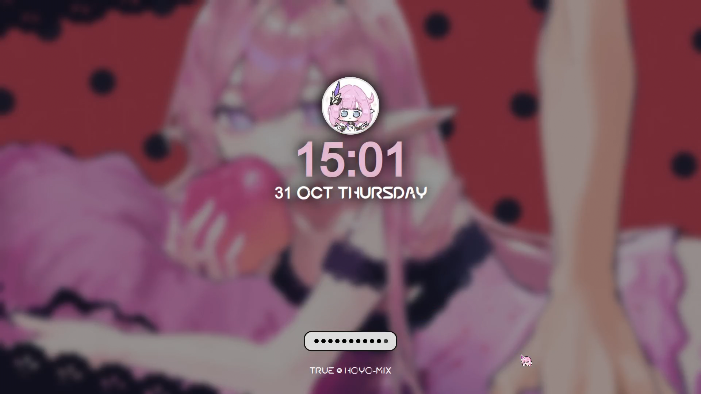
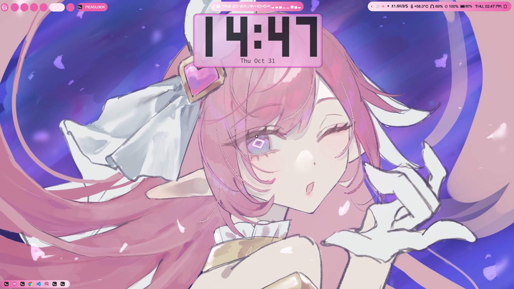
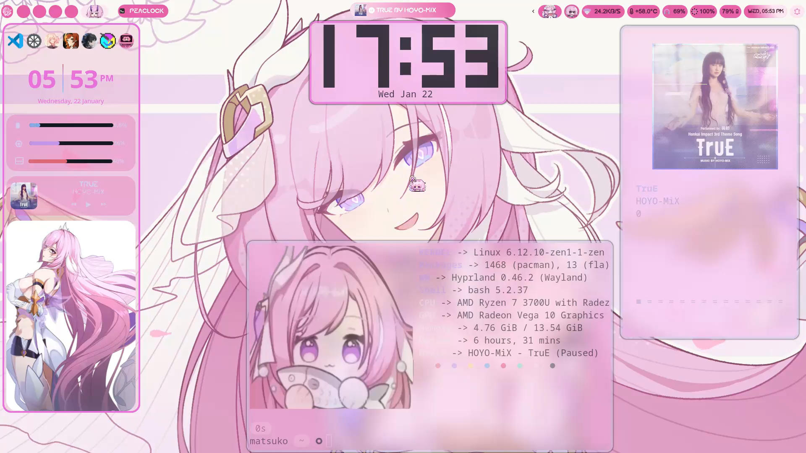

# 🌸 ElysiaOS DOTFILES 1.0 🌸

 

 

 

 

 

## Keybindings

| Keys | Action |
| :--- | :--- |
| <kbd>Super</kbd> + <kbd>Q</kbd> | Close focused window|
| <kbd>Super</kbd> + <kbd>SPACE</kbd> | Launch Application manager |
| <kbd>Super</kbd> + <kbd>T</kbd> | Terminal |
| <kbd>Super</kbd> + <kbd>L</kbd> | Lock your screen Hyprlock |
| <kbd>Super</kbd> + <kbd>M</kbd> | Powermenu |
| <kbd>Super</kbd> + <kbd>[0-9]</kbd> | Switch workspaces |
| <kbd>Super</kbd> + <kbd>SHIFT</kbd> + <kbd>S</kbd> | Workspaces viewer Hyprspace |
| <kbd>Super</kbd> + <kbd>W</kbd> | Opens Swaync Notifaction |
| <kbd>Super</kbd> + <kbd>TAB</kbd> | Widget for system info |
| <kbd>Super</kbd> + <kbd>SHIFT</kbd> + <kbd>W</kbd> | Launches Wallpapers menu |
| <kbd>Super</kbd> + <kbd>SHIFT</kbd> + <kbd>M</kbd> | Exit Hyprland alltogether |
| <kbd>Super</kbd> + <kbd>V</kbd> | Toggle float a window |
| <kbd>Super</kbd> + <kbd>D</kbd> | Launch text editor VSCODE |
| <kbd>Super</kbd> + <kbd>E</kbd> | Launch File manager Thunar |
| <kbd>Super</kbd> + <kbd>O</kbd> | Launch Floorp |
| <kbd>Super</kbd> + <kbd>D</kbd> | Launch text editor VSCODE |
| <kbd>Super</kbd> + <kbd>PRINTSC</kbd> | Take a full screenshot |
| <kbd>Super</kbd> + <kbd>S</kbd> | Take a region screenshot |

# Details
- **OS**: Arch Linux
- **WM**: [Hyprland](https://github.com/hyprwm/Hyprland)
- **Wallpaper**: [swww](https://github.com/LGFae/swww)
- **Applications Launcher**: [rofi](https://github.com/lbonn/rofi)
- **Top Bar**: [Waybar](https://github.com/Alexays/Waybar)
- **Widgets**: [eww](https://github.com/elkowar/eww)
- **Notifications**: [Swaync](https://github.com/ErikReider/SwayNotificationCenter)
- **Terminal**: [kitty](https://github.com/kovidgoyal/kitty)
- **Theme**: `Use the themes in .themes`
- **Icons**: 'Currently cannot provide them but you can get them from [here](https://ko-fi.com/s/e3be105b94)'
- **Cursors**: '[1st](https://ko-fi.com/s/58bc1bc84c) [2nd](https://www.pixiv.net/en/users/16588440) both in .icons'