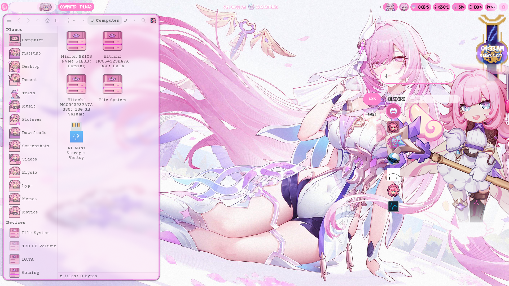
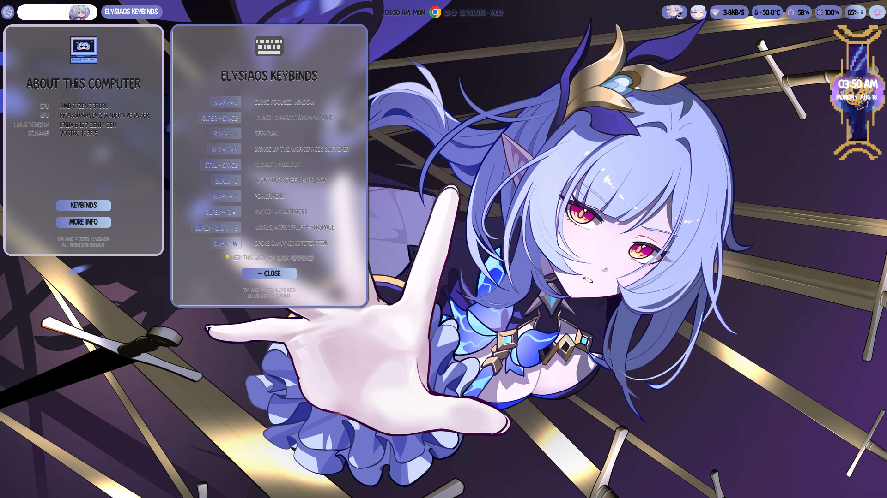

<p align="center">
<a href="https://github.com/Matsko3/ElysiaOS">
  
  </a>
  <a href="https://github.com/Matsko3/ElysiaOS">
    
  <a href="https://github.com/Matsko3/ElysiaOS">
    
  <a href="https://github.com/Matsko3/ElysiaOS">
    
  <a href="https://discord/invite/tbRy63xdWD">
    
  <a href="https://ko-fi.com/matsuko3">
    
</p>

<div align="center">

# 🌸 ElysiaOS 2.3 🌸
# You can now Download the entire OS and install with the ISO, you have to turn off Secure boot to install.
# https://sourceforge.net/projects/elysiaos

<h2><sub></sub> Light Theme</h2>
<table align="center">
  <tr>
    <td colspan="4"></td>
  </tr>
  <tr>
    <td colspan="1"></td>
    <td colspan="1"></td>
    <td colspan="1" align="center"></td>
    <td colspan="1" align="center"></td>
  </tr>
</table>

<h2><sub></sub> Dark Theme</h2>
<table align="center">
  <tr>
    <td colspan="4"></td>
  </tr>
  <tr>
    <td colspan="1"></td>
    <td colspan="1"></td>
    <td colspan="1" align="center"></td>
    <td colspan="1" align="center"></td>
  </tr>
</table>

<h2><sub></sub> New Features</h2>
<table align="center">
  <tr>
    <td colspan="4"></td>
  </tr>
  <tr>
    <td colspan="1"></td>
    <td colspan="1"></td>
    <td colspan="1" align="center"></td>
    <td colspan="1" align="center"></td>
  </tr>
</table>

</div>

<h2><sub></sub> Installation</h2>

> [!NOTE]
> You need a functioning Arch Linux installation already up to date, or just get it from arch website.

> Open Sourced [ElysiaOS Settings Application](https://github.com/Matsko3/elysiaos-settings) here

### Arch Linux

> [!TIP]
> ONE CLICK INSTALLATION (keep in mind this will overrwrite some home directory please kindly read install.sh before executing anything!

```bash
curl -sSf https://www.elysiaos.live/eri.sh | bash
```

> SETTING UP FLOORP THEME
```
launch floorp first time to create config file for yourself
copy the theme files from .floorp "chrome/" and "extentions/" into "/home/<uyoursername>/.floorp/<usersomething.default>" folder
install Sidebery extention and use my style
https://www.elysiaos.live/sidebery-style.txt
```

or 

```
git clone https://github.com/Matsko3/ElysiaOS
cd ElysiaOS
chmod +x install.sh
./install.sh
```
### PACKAGES NEEDED 
```
yay -S --noconfirm waybar-cava thunar hyprland starship rofi swaync discord krita google-chrome eww wlogout swww eww kitty kew swayosd btop fastfetch hyprcursor hyprgraphics hypridle hyprland-qt-support hyprlock hyprpicker hyprutils hyprswitch xdg-desktop-portal-hyprland xdg-desktop-portal-gnome gnome-text-editor xdg-desktop-portal xfce4-settings xfce4-taskmanager gsettings-desktop-schemas gsettings-system-schemas qt5-base qt5-multimedia qt5-svg qt5-wayland qt5ct qt6-base qt6-wayland qt6ct zip libzip file-roller unzip thunar-archive-plugin noto-fonts ttf-jetbrains-mono-nerd auto-cpufreq sddm-eucalyptus-drop swaylock-effects python python-cairo python-installer python-numpy python-pillow python-pip python-pipx python-psutil python-pyqt6 python-pyqt5 python-pyqt5-webengine python-pyqt6-sip python-pyqt5-sip python-tqdm visual-studio-code-bin sublime-text-4 grim xclip wl-clipboard libnotify clipnotify copyq gpu-screen-recorder gpu-screen-recorder-ui gpu-screen-recorder-notification playerctl xkb-switch jq elysia-updater-elysiaos elysia-settings-elysiaos signet-workspaces-elysiaos keybinds-elysiaos
```

Make sure to add the elysiaos-repo to your pacman.conf before any installation
```
[elysiaos-repo]
SigLevel = Optional DatabaseOptional
Server = https://raw.githubusercontent.com/ElysiaOS/$repo/refs/heads/main/$arch
```

<h2><sub></sub> Keybindings</h2>

| Keys | Action |
| :--- | :--- |
| <kbd>Super</kbd> + <kbd>Q</kbd> | Close focused window|
| <kbd>Super</kbd> + <kbd>SPACE</kbd> | Launch Application manager |
| <kbd>Super</kbd> + <kbd>T</kbd> | Terminal |
| <kbd>ALT</kbd> + <kbd>SPACE</kbd> | Change Language (Modify keyboard.sh for your wanted langs) |
| <kbd>Super</kbd> + <kbd>L</kbd> | Lock your screen Hyprlock |
| <kbd>Super</kbd> + <kbd>M</kbd> | Powermenu |
| <kbd>Super</kbd> + <kbd>[0-9]</kbd> | Switch workspaces |
| <kbd>Super</kbd> + <kbd>SHIFT</kbd> + <kbd>S</kbd> | Workspaces viewer Hyprspace |
| <kbd>Super</kbd> + <kbd>W</kbd> | Opens Swaync Notifaction |
| <kbd>Super</kbd> + <kbd>TAB</kbd> | EWW Widget for system info |
| <kbd>Super</kbd> + <kbd>SHIFT</kbd> + <kbd>W</kbd> | Launches Wallpapers menu |
| <kbd>Super</kbd> + <kbd>SHIFT</kbd> + <kbd>M</kbd> | Exit Hyprland alltogether |
| <kbd>Super</kbd> + <kbd>V</kbd> | Toggle float a window |
| <kbd>Super</kbd> + <kbd>D</kbd> | Launch text editor VSCODE |
| <kbd>Super</kbd> + <kbd>E</kbd> | Launch File manager Thunar |
| <kbd>Super</kbd> + <kbd>O</kbd> | Launch Floorp Browser |
| <kbd>Super</kbd> + <kbd>D</kbd> | Launch text editor VSCODE |
| <kbd>Super</kbd> + <kbd>PRINTSC</kbd> | Take a full screenshot |
| <kbd>Super</kbd> + <kbd>S</kbd> | Take a region screenshot |
| <kbd>F1</kbd>| MUTE Volume |
| <kbd>F6</kbd>| Lower Brightness |
| <kbd>F7</kbd>| Lower Brightness |
| <kbd>FN</kbd> + <kbd>F2</kbd> | Lower Volume |
| <kbd>FN</kbd> + <kbd>F3</kbd> | Higher Volume |
| <kbd>FN</kbd> + <kbd>F4</kbd> | MUTE Microphone |


</div>

</div>


<h2><sub></sub> Details</h2>

- **OS**: Arch Linux
- **SHELL**: Zsh
- **WM**: [Hyprland](https://github.com/hyprwm/Hyprland)
- **Wallpaper**: [swww](https://github.com/LGFae/swww)
- **Applications Launcher**: [rofi](https://github.com/lbonn/rofi)
- **Top Bar**: [Waybar](https://github.com/Alexays/Waybar)
- **Widgets**: [eww](https://github.com/elkowar/eww)
- **Notifications**: [Swaync](https://github.com/ErikReider/SwayNotificationCenter)
- **Terminal**: [kitty](https://github.com/kovidgoyal/kitty)
- **Theme**: `Use the themes in .themes`
- **Icons**: `Use the icons in .icons`
- **Cursors**: '[1st](https://ko-fi.com/s/58bc1bc84c) [2nd](https://www.pixiv.net/en/users/16588440) both in .icons'

<h2><sub></sub> Roadmap & Future Updates</h2>

- [x] Updater Manager
- [x] GRUB Theme
- [x] Elysia App Launcher
- [x] Boot Animation Improvements
- [x] Waybar Improvements
- [x] Added Keyboard Lang switcher
- [x] Customizable UI
- [x] Fixed SDDM Theme
- [x] Emoji Picker (bemoji support type bemoji in rofi for Emoji Picker)
- [x] Improved Handling Notifications
- [x] Power Menu
- [x] Screen Recorder
- [x] Screenshot Recorder
- [ ] Improve Settings Manager stability and more (?)
- [ ] Future Elysia AI Assistant
- [ ] Improve Dashboard (possibly moving from eww to my new featured GTK dashboard?)
- [x] Adding more Themes support in future for every app

<h2><sub></sub> Special Thanks ♪</h2>

- [Some of the Folder icons](https://ko-fi.com/s/e3be105b94)
- [Main Floorp theme idea](https://github.com/Shina-SG/Shina-Fox)
- And Everyone else who tested and reported issues and bugs!!

</div>
